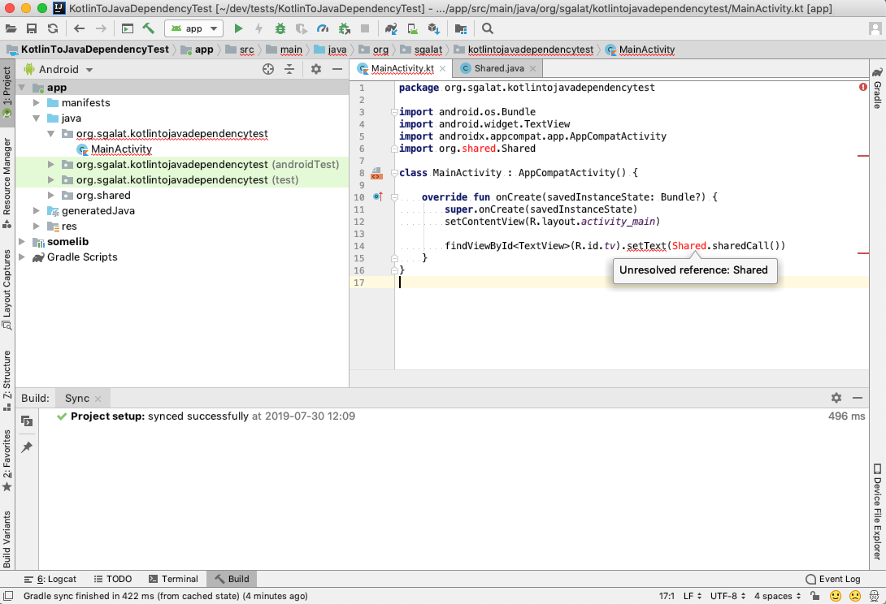

# Kotlin-To-Java Dependency Test App

## Goal

Demonstrate an issue in Android Studio when a shared Java class is being referenced from Kotlin code.

## Prerequisites

Android Studio 3.4.2 (also reproducible in 3.5 RC1 and 3.6 Canary 5).

## Description

IDE displays annoying `unresolved reference` errors when a Java class is referenced from Kotlin code in an app module, while the same Java class is also included in a library module in the same project. The build completes just fine and there doesn't seem to be any issue with the project structure.

## Steps

1. Clone this GitHub project.
2. Open the project in Android Studio.
3. Wait until Gradle sync and index building are finished.
4. *Optional*: Navigate to the `MainActivity.kt` file. At this point no syntax issues should be displayed.
5. *Optional*: Verify that the build completes without errors.
5. Close the project.
6. Re-open the project in Android Studio.
7. Navigate to the `MainActivity.kt` file again. IDE would display an `unresolved reference` error for the `Shared` java class.
8. *Optional*: Verify that the build still completes without errors.

## Screenshot

